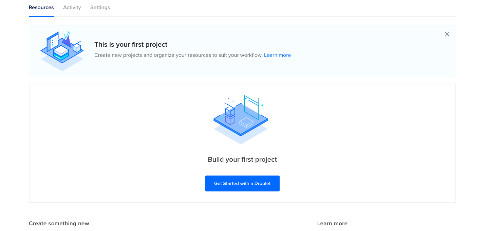
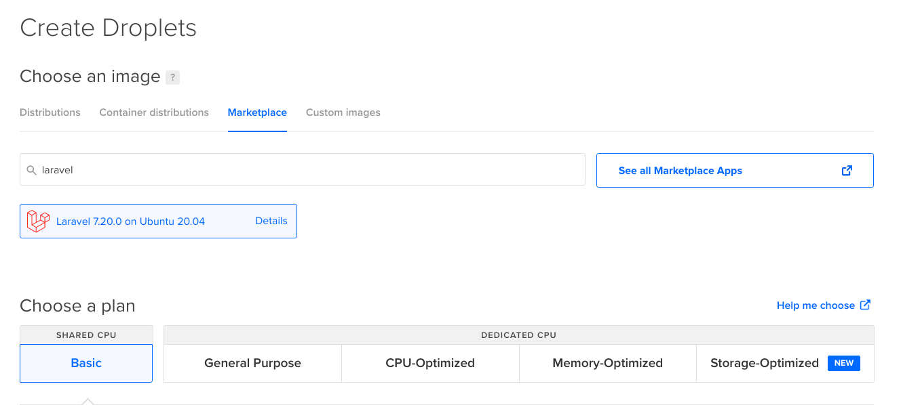
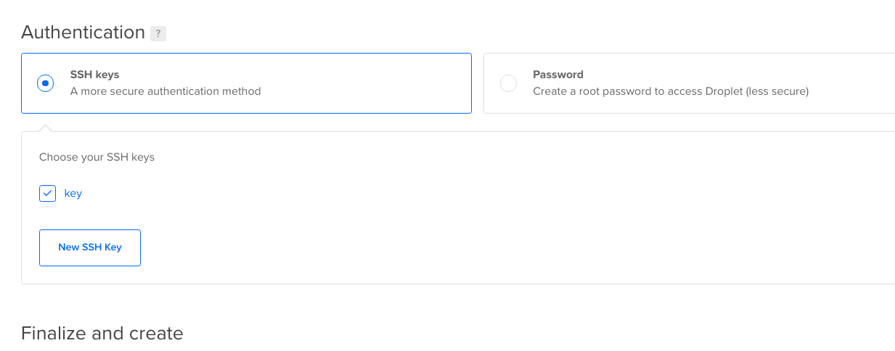
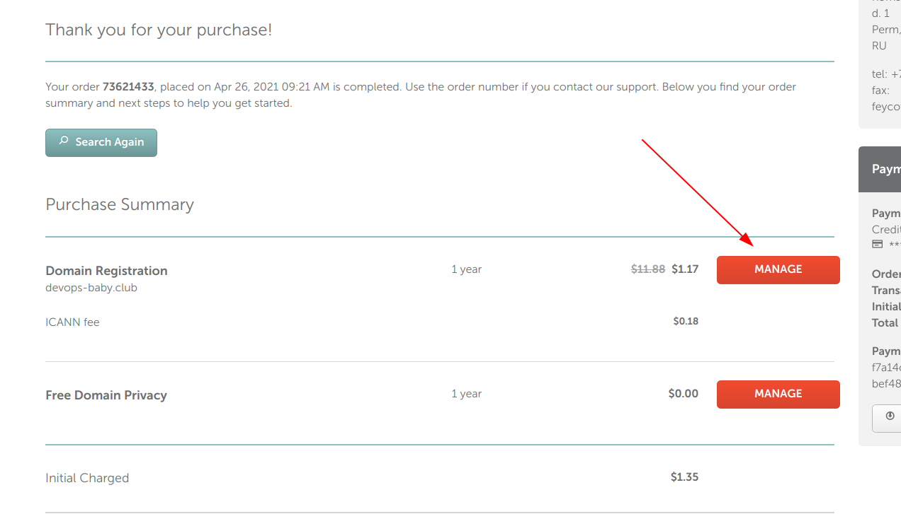
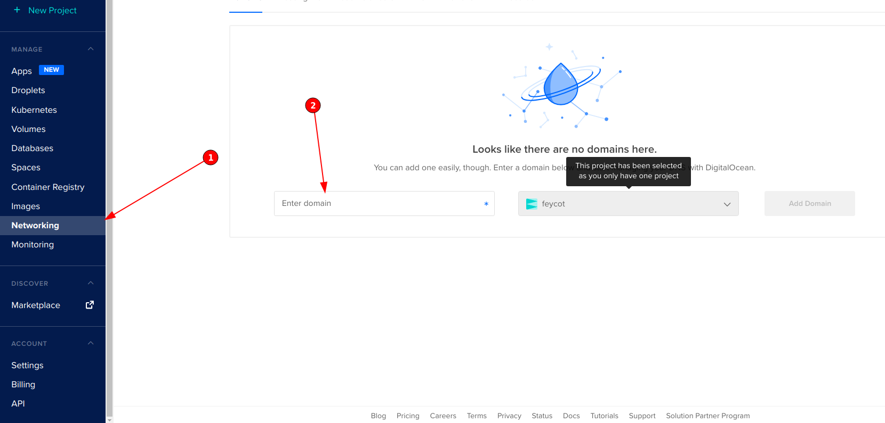
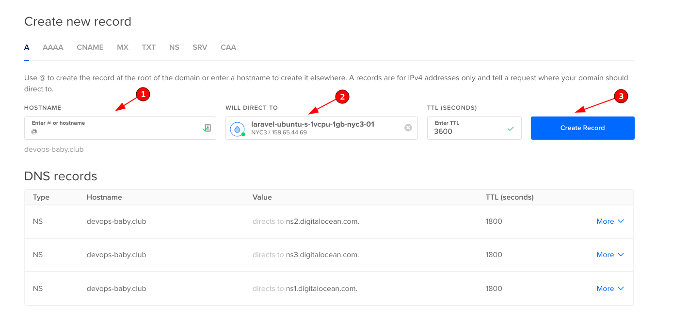
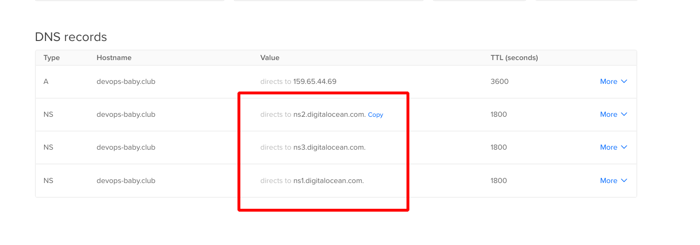
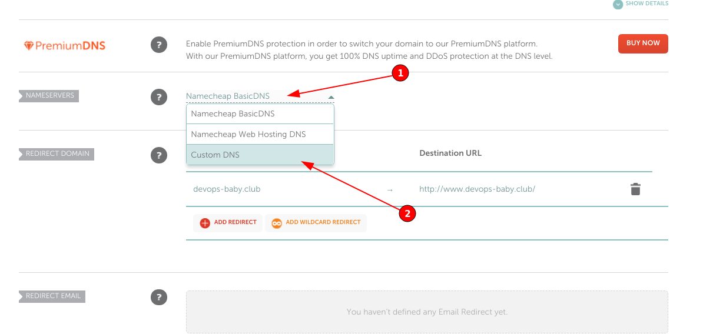
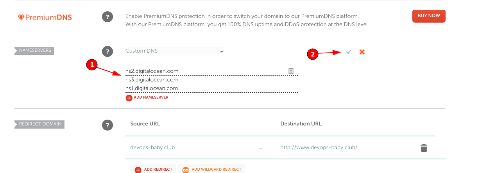

# Продакшен

Продакшен-среда — инфраструктура (например, сервера), в которой развернут проект. Она обеспечивает доступ к проекту конечным пользователям.

Зарегистрируйте домен и создайте свой сервер на [Digital Ocean](https://m.do.co/c/e702f9a99145).

Если по каким-то причинам не удаётся зарегистрироваться на Digital Ocean или закончился кредит - используйте Linode, [ссылка для регистрации](https://www.linode.com/lp/affiliate-referral/?irclickid=yWGRVKQWoxyLW0W0EOSREQreUkBzKrTQtXlQUw0&irgwc=1&utm_source=impact).

## Ссылки

* [Регистрация на DO](https://m.do.co/c/e702f9a99145)
* [Namecheap](http://namecheap.com/)
* [Reg.ru](https://reg.ru/)
* [Что такое DNS](https://guides.hexlet.io/dns/)
* [Что такое SSH](https://guides.hexlet.io/ssh/)
* [Чек-лист хороших инженерных практик в компаниях](https://guides.hexlet.io/check-list-of-engineering-practices/)
* [Среды разработки](https://ru.hexlet.io/blog/posts/environment)
* [Что такое домен и хостинг](https://guides.hexlet.io/hosting/)

## Digital Ocean

* Зарегистрируйтесь на Digital Ocean по ссылке [Регистрация на DO](https://m.do.co/c/e702f9a99145). Подтвердите электронную почту и укажите платежные данные. С вас могут снять $1, который сразу же вернется
**При выборе способа оплаты "PayPal" с вас снимут $5 и их не вернут**

* Создайте дроплет. Выберите из Marketplace готовое приложение. На [странице маркетплейса](https://marketplace.digitalocean.com/) Можно посмотреть список всех приложений или найти возможное через поиск по названию. Выбирайте приложение с web-доступом, например:

  * Laravel
  * NodeJS
  * LAMP
  * LEMP
  * Wordpress
  * Django
  * Ruby On Rails

* Измените характеристики сервера. Выберите самый дешевый тариф. Дата-центр может быть любом

* Укажите ваш публичный ssh-ключ

* Создайте сервер с получившейся конфигурацией
* После создания сервера (завершения прогресс-бара) попробуйте подключиться к серверу по IP. Имя пользователя - *root*

## Регистрация домена

Ниже описана инструкция для регистрации в Namecheap. Если по каким-то причинам сервис не подходит, можно использовать любой другой. Например Reg.ru 

* Зайдите на Namecheap и выберите имя домена. Выберите самую дешевую доменную зону (например на .club стоит примерно $1,35)
* Для покупки потребуется регистрация. Заполните регистрационные данные и контактную информацию. Заполните контактную информацию о домене. Она может отличаться от той, что указана для аккаунта
* На электронную почту придет письмо с подтверждением. Необходимо будет перейти по ссылке
* После успешной оплаты переходите к управлению доменом

## Привязка домена к Digital Ocean

* В панели управлению Digital Ocean перейдите во вкладку Networking
* Впишите название вашего домена. По умолчанию будет выбран созданный первый проект

* Заполните A запись для вашего сервера, как на скриншоте. Hostname - `@`, Will redirect to - `ваш сервер`.

* Делегируйте Домен из Namecheap в Digital Ocean. Для этого на странице управления доменом в Namecheap пропишите NS записи. Их можно получить на странице Digital Ocean: Networking - Domains на странице домена. При клике на NS запись она копируется в буфер обмена

* Выбираем Custom DNS на странице управления доменом в Namecheap и вставляем все три NS сервера. В конце нажимаем на галочку для подтверждения

* Обновление записей для нового домена может происходить несколько часов
* Проверьте доступность вашего приложения открыв его в браузере. Попробуйте подключиться по SSH

  Итогом задания должно стать работающее приложение на сервере DO и на вашем домене.

* В файле *solution* добавьте ссылку на задеплоенное приложение: http://<адрес>
