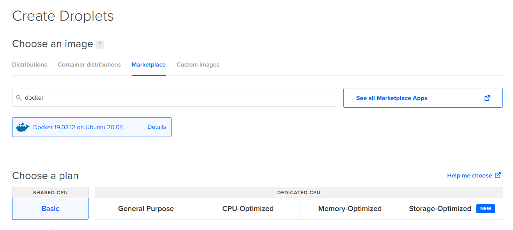

# Деплой на один сервер

Задеплойте готовое приложение с помощью Ansible и Docker.

Для простоты в этой домашней работе мы будем использовать готовый образ докера с запакованным туда приложением — [hexletcomponents/devops-example-app](https://hub.docker.com/r/hexletcomponents/devops-example-app). Это простое веб-приложение, оно использует переменную окружения `SERVER_MESSAGE` для вывода на страницу сообщения.

```bash
docker run -p 3000:3000 -e SERVER_MESSAGE="Hexlet Awesome Server" hexletcomponents/devops-example-app
```

В результате запущенное приложение будет доступно в браузере.

## Ссылки

* [DevOps example app](https://github.com/hexlet-components/devops-example-app)
* [Образ DevOps example app](https://hub.docker.com/r/hexletcomponents/devops-example-app)
* [Документация Ansible](https://docs.ansible.com/ansible/latest/index.html)
* [DigitalOcean Documentation](https://docs.digitalocean.com/)
* [Encrypting content with Ansible Vault](https://docs.ansible.com/ansible/latest/user_guide/vault.html)
* [ansible-valut cli](https://docs.ansible.com/ansible/latest/cli/ansible-vault.html)
* [community.docker.docker_container](https://docs.ansible.com/ansible/latest/collections/community/docker/docker_container_module.html)
* [Ansible galaxy installing guide](https://galaxy.ansible.com/docs/using/installing.html)
* [Чек-лист хороших инженерных практик в компаниях - Выкатка новых версий](https://guides.hexlet.io/check-list-of-engineering-practices/#%D0%B2%D1%8B%D0%BA%D0%B0%D1%82%D0%BA%D0%B0-%D0%BD%D0%BE%D0%B2%D1%8B%D1%85-%D0%B2%D0%B5%D1%80%D1%81%D0%B8%D0%B9-%D0%B1%D0%BE%D0%BB%D0%B5%D0%B5-%D0%B0%D0%BA%D1%82%D1%83%D0%B0%D0%BB%D1%8C%D0%BD%D0%BE-%D0%B4%D0%BB%D1%8F-%D0%B2%D0%B5%D0%B1-%D0%BF%D1%80%D0%BE%D0%B5%D0%BA%D1%82%D0%BE%D0%B2)

## Задач

В качестве альтернативы Digital Ocean можно использовать других облачных провайдеров - Linode, Yandex Cloud.

* Запустите проект *devops-example-app* локально следуя инструкциям в README проекта. Поэкспериментируйте, передавая разные значения переменной окружения `SERVER_MESSAGE` и посмотрите как изменяется вывод на странице приложения

* Создайте на Digital Ocean дроплет с Docker on Ubuntu. Он находится в маркетплейсе

  

* Подключитесь по SSH к серверу на Digital Ocean и запустите вручную *devops-example-app* внутри Docker. Откройте в браузере приложение по адресу *http://<адрес сервера>:3000*, убедитесь, что приложение работает

* Создайте инвентори файл и добавьте созданный сервер в группу хостов *webservers*. Укажите алиас сервера, хост, имя пользователя для подключения (root)

* Создайте файл *requirements.yml* и добавьте в него коллекцию `community.docker` из Ansible Galaxy.

* Создайте файл *group_vars/webservers.yml*. Поместите в него зашифрованную переменную `server_message`

* Добавьте в плейбук *playbook.yml* деплой приложения *devops-example-app* на созданный ранее сервер. В плейбуке используйте модуль *community.docker.docker_container* для запуска контейнера.

* Передайте значение переменной `server_message` в переменную окружения `SERVER_MESSAGE` внутри контейнера.

* Создайте *Makefile* и определите в нем команды

  * `deploy` — команда запускает плейбук, подготавливает сервер и выполняет деплой приложения
  * `install` — команда установи зависимостей из *requirements.yml*

* Задеплойте приложение. Проверьте, что приложение открывается в браузере и на странице выводится сообщение из переменной

* В файле *solution* добавьте ссылку на задеплоенное приложение: http://<адрес>
